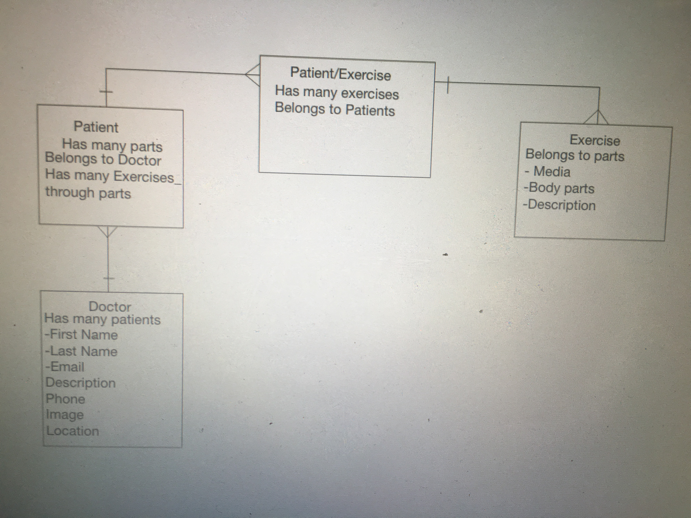

#Project 3 - Physical Therapy App

#User Stories/Scope:
App Goal: Allow the user and the physician to communicate and interact online. Physician will be able to assign exercises via digital media (pictures/gif, videos, descriptions) to the patients

There are two users : patient and doctor.

Patient: the patient will be able to log in/sign up,  view the doctors, choose a doctor, view the list of exercises prescribed by the doctor, and view the overall exercise index page
 
Doctors: the physician will be able to log in/sign up, to view the patient profile, assign/remove the exercises to the patient

We'll have three models: patients,  doctors and exercises. The patient and exercises are connected by a joint table

Technologies Used:
* Upload-Care / PaperClip
* Friendly-ID
* JS/Jquery for front-end
* AJAX

#Planning: 
[Trello] (https://trello.com/b/2hUBMDlJ)
[Schedule/Milestone] (https://docs.google.com/spreadsheets/d/1v_VcVBdGkPDtkP9yZEItrfRznMJE9yYMZdebbxAq5Pc/edit#gid=0)

#Wireframes:

Wireframes

[Wireframe PDF](./planning/images.pdf)

